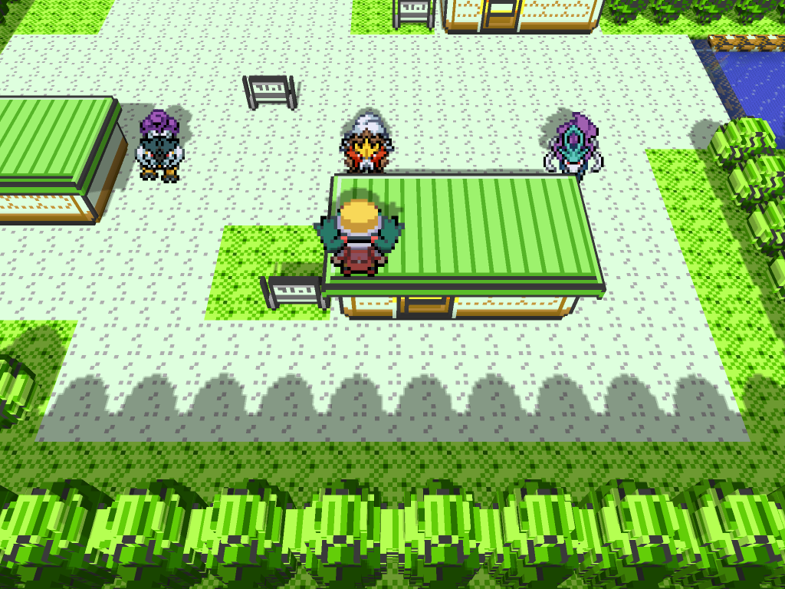
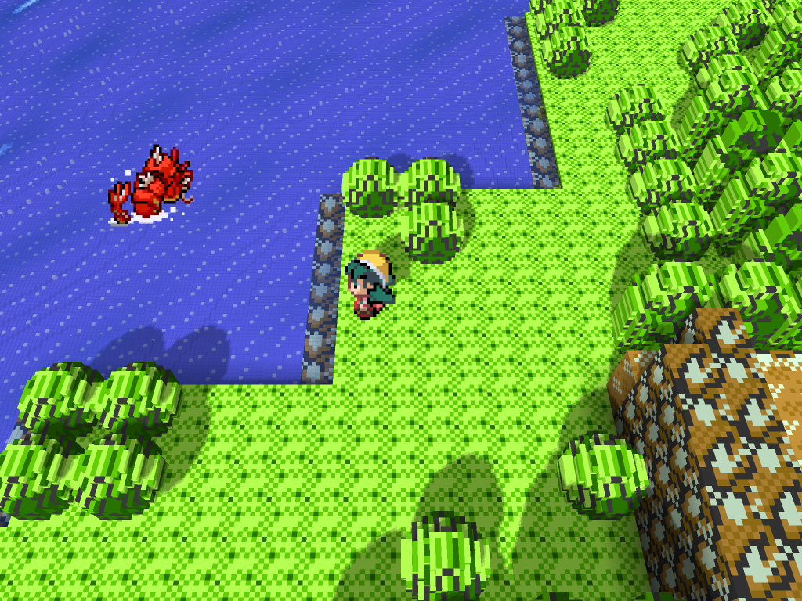
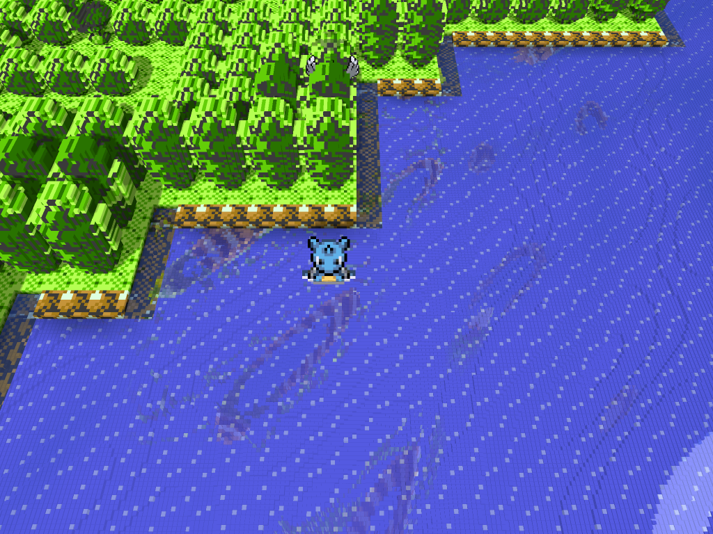
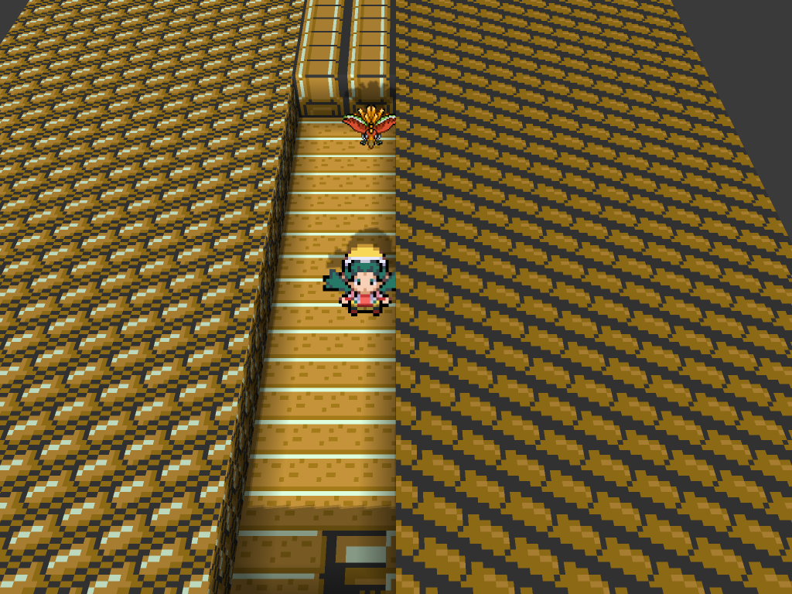

# HGSS Visual Overhaul for Gen1Recomp

HGSS Visual Overhaul is a visual companion for [g1recomp](https://github.com/bryanthaboi/gen1recomp). It brings HeartGold/SoulSilver-inspired character art, full-color Pokémon artwork and animated interface assets to Pokémon Red, Blue, Yellow, Gold, Silver and Crystal while preserving each game's logic and map geometry.

## What version 2.0.5 provides

### Overworld

- HGSS-style, full-color overworld charsets with complete six-frame movement for the player, NPCs, Gym Leaders, Elite Four, Team Rocket, Black Belts, map objects and named Pokémon.
- Player selection: `RED`, `ASH`, `ETHAN`, `LYRA`, `KRIS`, `KRIS V2`, `LEAF` or
  `BRENDAN`, with matching
  overworld and bicycle sheets where available.
- Dedicated walking and bicycle sheets for the supported player choices, plus the HGSS Pikachu follower and forced Surfing Pikachu.
- Corrected species-specific map objects, including the legendary birds, Mewtwo, Fearow, Kabuto, Voltorb/Electrode, Wigglytuff and both Snorlax roadblocks.
- Grounding, shadow alignment and day/night tinting designed to match both 2D and Voxel renderers.
- Global overworld size control from `0.5x` to `1.0x` in `0.1x` steps (default: `0.8x`).
- Dedicated Poké Center/Hotel lounge visitor replacement that keeps the original interaction behavior.

### Battle and presentation

- Bundled battle front, back and trainer artwork for generations 1–5; the mod works without Battle Art installed.
- `TRAINERS ONLY` is the default battle scope. `COMPLETE` additionally replaces bundled Pokémon battle artwork.
- Player battle intro follows the selected player (`RED`, `ASH`, `ETHAN`,
  `LYRA`, `KRIS`, `KRIS V2`, `LEAF` or `BRENDAN`), including the dedicated animated battle back
  atlases.
- Animated and full-color artwork is kept at native source quality, with transparent backgrounds for Voxel billboards.
- Shiny front artwork is included wherever the selected generation provides it, with safe fallback to the normal artwork.
- The selected generation can be configured independently for battle front, battle back and trainer art.

### Menus and icons

- Optional HGSS party screen with animated, full-color party icons; the original party screen remains available.
- Optional animated PC box icons for withdraw, deposit and release lists, with
  full-screen native-resolution transfer panels, aligned names, levels and
  cursors.
- Four-way party cursor navigation and aligned selection markers.
- Corrected catch-summary, evolution, Pokédex and Hall of Fame artwork paths.
- Menu options expose `PLAYER SELECT`, `BATTLE ART SCOPE`, battle generations, `PARTY MENU`, `PC BOX ICONS` and `SPRITE SIZE`.

## Gen 2 support

Gold, Silver and Crystal use a separate Gen 2 compatibility path. The hooks are
Gen2-only, so the established Red/Blue/Yellow behavior remains intact. Gen 2
adds:

- Ethan/Lyra as the new-save boy/girl defaults, plus live `PLAYER SELECT`
  switching to Ethan, Lyra, Kris, Kris V2, Leaf or Brendan after the save is
  running.
- Manual player changes now remain authoritative after choosing Girl: the
  female engine slot follows every menu choice, including RED, across save
  reloads. Gen 1 and Gen 2 also remember separate player selections, so a
  Johto protagonist no longer leaks into Red/Blue/Yellow when changing games.
- HGSS walking, bicycle, fishing and animated battle-back sheets with the
  same Voxel grounding, mirror and pivot corrections used by the overworld.
- HGSS redirects for the Gen 2 trainer/person registry and map objects,
  including Elm's Lab, the tutorial fisherman, the legendary dogs, Sudowoodo,
  the Lake of Rage shiny Gyarados, mounted Surf Lapras, Lugia and Ho-Oh.
- True-colour HGSS follow sprites and two-frame party/PC icons for all 251
  National Dex species. Party and PC layouts use the Yellow-style two-column
  treatment and hide the native GSC/front-static layers when enabled.
- Native Gen 2 battle presentation remains available; the Gen1-only battle
  Pokémon-generation controls stay hidden on Gold/Silver/Crystal. The
  Gen2-only `TRAINER ART` control defaults to `HGSS + GEN 3`: the 16 Gym
  Leaders, Elite Four and Champion Lance use dedicated HGSS portraits, while
  ordinary opponents use the bundled Gen 3 set. `ROM` switches every trainer
  back to the original cartridge portrait.

### Recommended Voxel combination

[Battle Art Voxel](https://github.com/absol89/DramaticShapeVoxelMod) is the
recommended Voxel renderer for Gen 2. [Wilds of Kanto](https://github.com/YoDrehDenSwagAuf/overworld-spawn-mod)
can run alongside it and this mod: Wilds supplies its 251-species
follow/overworld collection, Battle Art supplies the Voxel/battle presentation,
and HGSS Visual Overhaul supplies the audited Gen 2 object, character and menu
redirects. PotatoVoxel is not required.

The following captures were taken in g1recomp `0.2.45` with Crystal,
HGSS_SPRITES, Battle Art Voxel and Wilds of Kanto enabled. The dog and mascot
shots use the production Gen 2 sprite registry with camera-isolated QA
placements so Voxel geometry does not occlude the subjects.

## Screenshots (Voxel enabled)

These captures were taken in-game with the Voxel renderer active and show the shipped assets rather than mockups.

The following additional captures were taken with Voxel enabled and the
global overworld size set to `0.8x`. The Pallet Town scenes use daylight so the
ground shadows remain visible. Each scene contains only the requested
characters: Leaf or Brendan with Pikachu, then Red separated from Jessie and
James in Mt. Moon.

Leaf is available from `MOD > PLAYER SELECT > LEAF`; her dedicated walking,
bicycle and animated battle sprites are included in the package.

Brendan is available from `MOD > PLAYER SELECT > BRENDAN`; his dedicated
walking and bicycle sprites are included in the package.

Jessie and James are shown as complete, separated overworld sprites with the
player centered below them.

## Installation

Download the matching release package, then import the `HGSS_SPRITES` folder
from the g1recomp Mods screen. Version `1.0.5` is the Gen1 release line;
version `2.0.5` adds the Gold/Silver/Crystal support and fixes described above. Enable
the mod for the target game and restart after changing presentation options.

The package targets g1recomp Mod API 2 and supports the Red/Blue/Yellow and
Gold/Silver/Crystal runtimes. Battle Art Voxel is recommended for the Gen2
Voxel presentation; 2D mode remains fully supported.

## Recommended companion mods

These projects are optional recommendations for a more complete playthrough. HGSS Visual Overhaul does not require them to load:

- [Shiny Mod](https://github.com/masterwebx/gen1recomp-shiny-pokemon/releases) — enables shiny encounter/party states.
- [Battle Art Voxel](https://github.com/absol89/DramaticShapeVoxelMod) — recommended Gen2 Voxel/battle presentation and battle-art tooling.
- [Colosseum UI](https://github.com/HighDrexler/Colosseum-Inspired-UI-Overhaul-V.1.0.0/releases) — optional battle interface overhaul.
- [Wilds of Kanto](https://github.com/YoDrehDenSwagAuf/overworld-spawn-mod) — expanded overworld/follow sprites and encounters; compatible with the Gen2 path.
- [Pokéball Colors](https://github.com/mistermiracle3036/Pokeball-Colors/releases/) — alternate Pokéball palettes.
- [All Pokémon Catchable](https://github.com/wowabox/All_Pokemon_Catchable_151_Mod/releases) — makes all 151 Pokémon obtainable.
- [EXP Share Modes](https://github.com/ShaneMcGovernIE/exp_share/releases) — configurable EXP Share behavior.

## Credits and scope

The battle asset library and compatibility conventions were adapted from the public [DramaticShapeVoxelMod / Battle Art Voxel](https://github.com/absol89/DramaticShapeVoxelMod) project. This mod bundles its own resolver and assets and does not declare Battle Art as a required dependency. The Leaf and Brendan player battle/overworld artwork is credited to `setogabes` on Discord. Original image sources and per-asset credits are listed in [`hgss_sprites/assets/battle/README.md`](hgss_sprites/assets/battle/README.md).

For the mod-specific manifest, option reference and asset layout, see [`hgss_sprites/README.md`](hgss_sprites/README.md).
