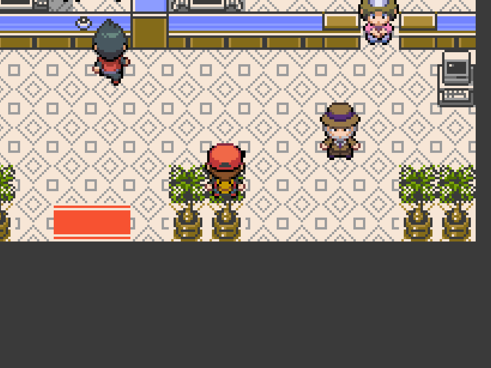

# Gen1Recomp Mods

Mods for [g1recomp](https://github.com/bryanthaboi/gen1recomp).

## HGSS Visual Overhaul

A companion for [Battle Art Voxel Fork](https://github.com/absol89/DramaticShapeVoxelMod)
for Pokemon Yellow. It replaces only the intro portraits, adds HGSS overworld
charsets, and provides the new flat 2D battle HUD. The cited fork remains the
owner of battle and voxel artwork.

[Mod documentation, screenshots and installation guide](hgss_sprites/README.md)

[Latest release](https://github.com/LucianoNeo/gen1recomp-mods/releases/tag/v0.2.0) ·
[Download HGSS_SPRITES 0.2.0](https://github.com/LucianoNeo/gen1recomp-mods/releases/download/v0.2.0/HGSS_SPRITES-0.2.0.zip)

## Quick installation

1. Install Battle Art Voxel Fork.
2. Download the HGSS_SPRITES ZIP from the release above.
3. Import it through the g1recomp mod manager and restart the game.

Release: `0.2.0` · Lean runtime package · Compatible with g1recomp
`>=0.1.75 <0.2.0`.
