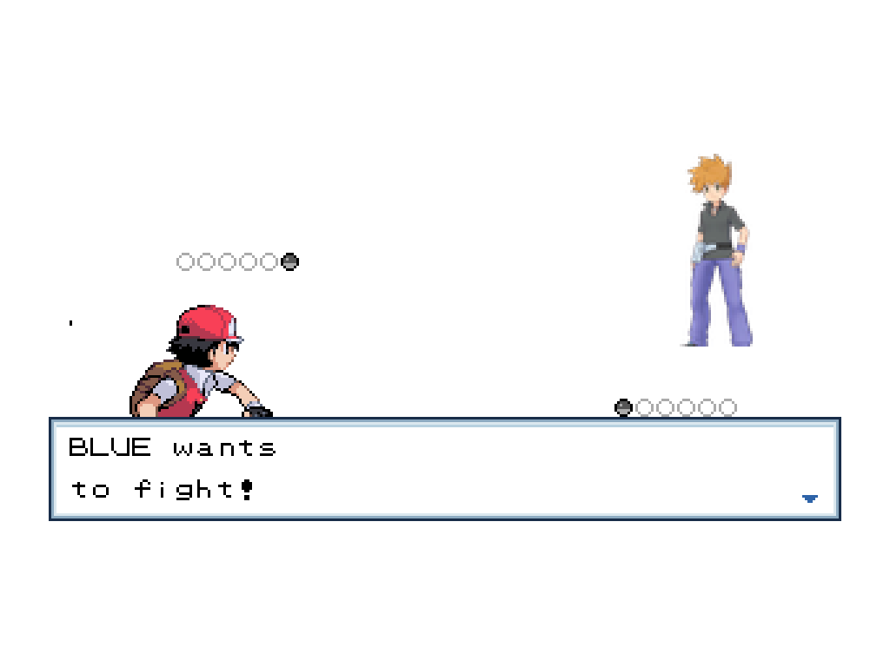

# Gen1Recomp Mods

Mods for [g1recomp](https://github.com/bryanthaboi/gen1recomp).

## HGSS Visual Overhaul

A **Pokémon Yellow** visual overhaul inspired by **Pokémon HeartGold and
SoulSilver**. It replaces battle art, overworld characters, Pokémon party
icons, and interface elements while preserving full RGB color and Nintendo DS
asset density wherever the engine allows it.

[Open the mod documentation, screenshots, and installation guide](hgss_sprites/README.md)

[Open the latest release](https://github.com/LucianoNeo/gen1recomp-mods/releases/tag/v0.1.0)

[Download HGSS_SPRITES 0.1.0](https://github.com/LucianoNeo/gen1recomp-mods/releases/download/v0.1.0/HGSS_SPRITES-0.1.0.zip)

## Quick installation

1. Download the ZIP from the latest release.
2. Import it through the g1recomp mod manager.
3. Enable **HGSS Visual Overhaul** and restart the game.

Release: `0.1.0` · Lean runtime package ·
Compatible with g1recomp `>=0.1.75 <0.2.0`.
