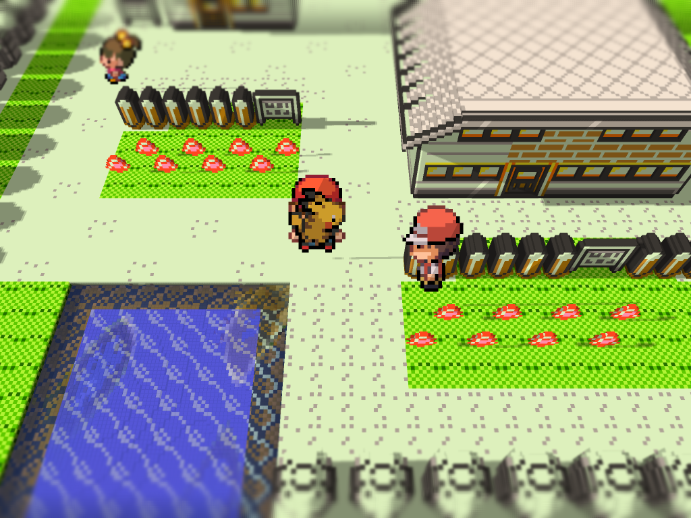
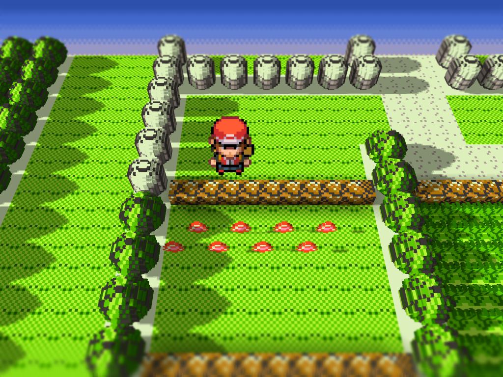
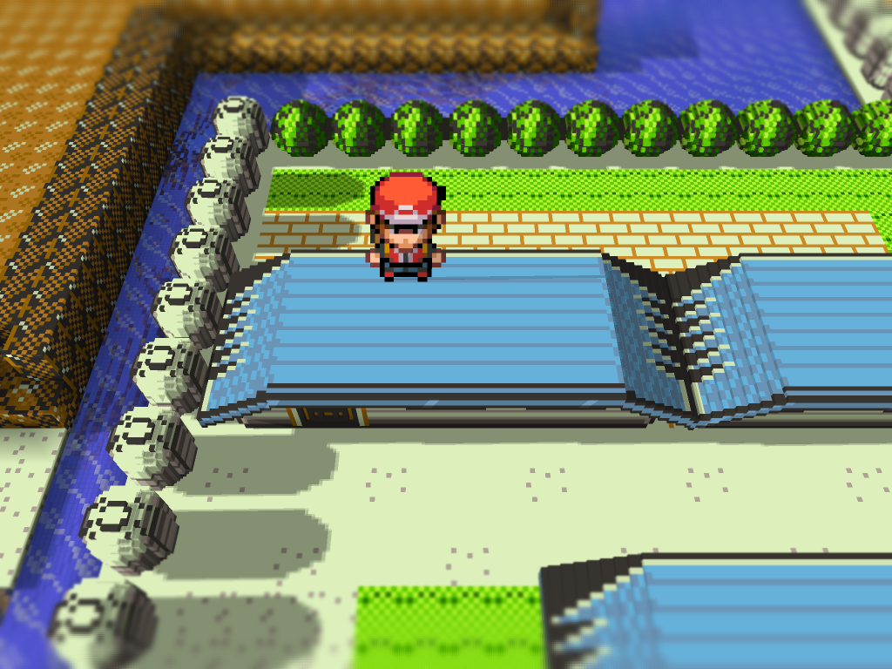

# Gen1Recomp Mods

Mods for [g1recomp](https://github.com/bryanthaboi/gen1recomp).

## HGSS Visual Overhaul

A companion for [Battle Art Voxel Fork](https://github.com/absol89/DramaticShapeVoxelMod)
for Pokemon Yellow. It replaces only the intro portraits and adds HGSS
overworld charsets. The cited fork remains the owner of battle, voxel artwork
and HUD.

[Mod documentation, screenshots and installation guide](hgss_sprites/README.md)

[Releases](https://github.com/LucianoNeo/gen1recomp-mods/releases) · `HGSS_SPRITES` 0.2.2

### Outdoor Voxel 3D

Fresh in-game captures with the Voxel pipeline enabled:

## Quick installation

1. Install Battle Art Voxel Fork.
2. Download the HGSS_SPRITES ZIP from the release above.
3. Import it through the g1recomp mod manager and restart the game.

Package: `0.2.2` · Lean runtime package · Compatible with g1recomp
`>=0.1.75 <0.2.0`.
