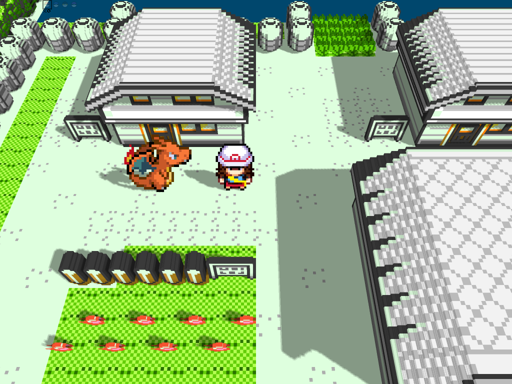
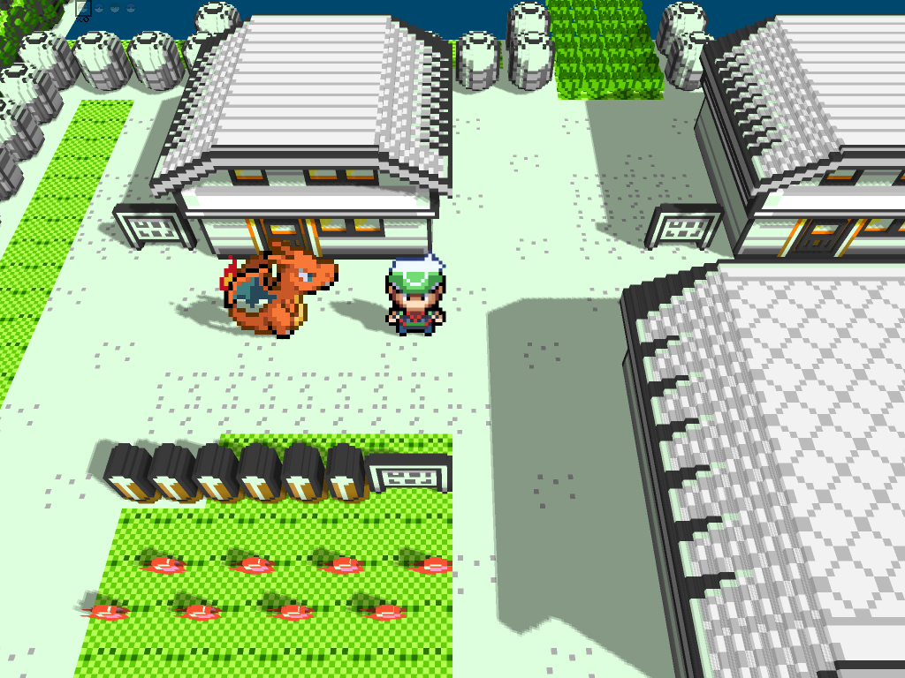
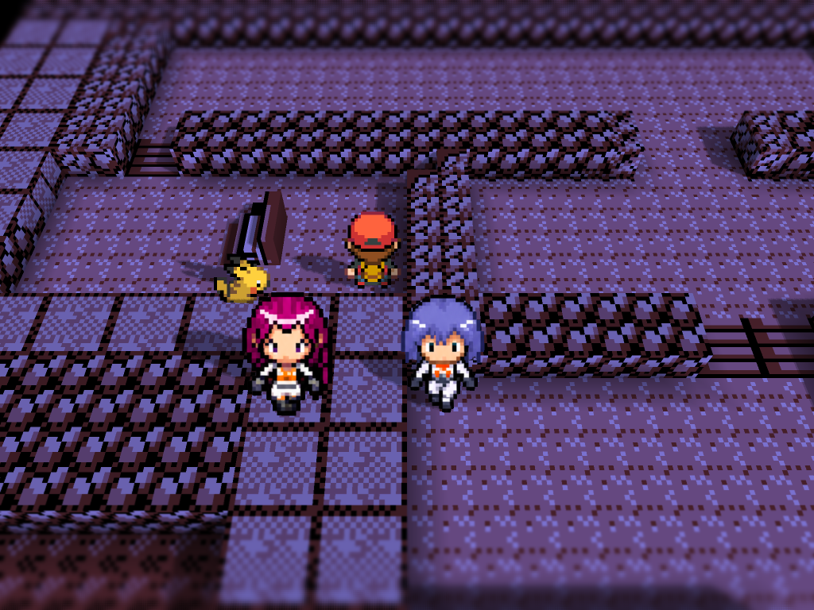

# HGSS Visual Overhaul for Gen1Recomp

HGSS Visual Overhaul is a complete visual companion for [g1recomp](https://github.com/bryanthaboi/gen1recomp). It brings HeartGold/SoulSilver-inspired character art, full-color Pokémon artwork and animated interface assets to Pokémon Red, Blue and Yellow while preserving the original game logic and map geometry.

## What version 1.0.3 provides

### Overworld

- HGSS-style, full-color overworld charsets with complete six-frame movement for the player, NPCs, Gym Leaders, Elite Four, Team Rocket, Black Belts, map objects and named Pokémon.
- Player selection: `RED`, `ASH`, `ETHAN`, `LYRA`, `LEAF` or `BRENDAN`, with matching
  overworld and bicycle sheets where available.
- Dedicated walking and bicycle sheets for the supported player choices, plus the HGSS Pikachu follower and forced Surfing Pikachu.
- Corrected species-specific map objects, including the legendary birds, Mewtwo, Fearow, Kabuto, Voltorb/Electrode, Wigglytuff and both Snorlax roadblocks.
- Grounding, shadow alignment and day/night tinting designed to match both 2D and Voxel renderers.
- Global overworld size control from `0.5x` to `1.0x` in `0.1x` steps (default: `0.8x`).
- Dedicated Poké Center/Hotel lounge visitor replacement that keeps the original interaction behavior.

### Battle and presentation

- Bundled battle front, back and trainer artwork for generations 1–5; the mod works without Battle Art installed.
- `TRAINERS ONLY` is the default battle scope. `COMPLETE` additionally replaces bundled Pokémon battle artwork.
- Player battle intro follows the selected player (`RED`, `ASH`, `ETHAN`,
  `LYRA`, `LEAF` or `BRENDAN`), including the dedicated animated battle back
  atlases.
- Animated and full-color artwork is kept at native source quality, with transparent backgrounds for Voxel billboards.
- Shiny front artwork is included wherever the selected generation provides it, with safe fallback to the normal artwork.
- The selected generation can be configured independently for battle front, battle back and trainer art.

### Menus and icons

- Optional HGSS party screen with animated, full-color party icons; the original party screen remains available.
- Optional animated PC box icons for withdraw, deposit and release lists.
- Four-way party cursor navigation and aligned selection markers.
- Corrected catch-summary, evolution, Pokédex and Hall of Fame artwork paths.
- Menu options expose `PLAYER SELECT`, `BATTLE ART SCOPE`, battle generations, `PARTY MENU`, `PC BOX ICONS` and `SPRITE SIZE`.

## Screenshots (Voxel enabled)

These captures were taken in-game with the Voxel renderer active and show the final 1.0.3 assets rather than mockups.

The following additional 1.0.3 captures were taken with Voxel enabled and the
global overworld size set to `0.8x`. The Pallet Town scenes use daylight so the
ground shadows remain visible. Each scene contains only the requested
characters: Leaf or Brendan with Pikachu, then Red separated from Jessie and
James in Mt. Moon.

Leaf is available from `MOD > PLAYER SELECT > LEAF`; her dedicated walking,
bicycle and animated battle sprites are included in the 1.0.3 package.

Brendan is available from `MOD > PLAYER SELECT > BRENDAN`; his dedicated
walking and bicycle sprites are included in the 1.0.3 package.

Jessie and James are shown as complete, separated overworld sprites with the
player centered below them.

## Installation

Download the release package from [HGSS Visual Overhaul 1.0.3](https://github.com/LucianoNeo/gen1recomp-mods/releases/tag/v1.0.3), then import `HGSS_SPRITES-1.0.3.zip` from the g1recomp Mods screen. Enable the mod for Red, Blue or Yellow and restart the game after changing presentation options.

The package targets the g1recomp Mod API 2 and is compatible with the current Red, Blue and Yellow runtimes. The companion Voxel renderer is optional; 2D mode remains fully supported.

## Recommended companion mods

These projects are optional recommendations for a more complete playthrough. HGSS Visual Overhaul does not require them to load:

- [Shiny Mod](https://github.com/masterwebx/gen1recomp-shiny-pokemon/releases) — enables shiny encounter/party states.
- [Battle Art Voxel](https://github.com/absol89/DramaticShapeVoxelMod/releases) — optional Voxel battle presentation and additional battle-art tooling.
- [Colosseum UI](https://github.com/HighDrexler/Colosseum-Inspired-UI-Overhaul-V.1.0.0/releases) — optional battle interface overhaul.
- [Wilds of Kanto](https://github.com/YoDrehDenSwagAuf/overworld-spawn-mod/releases/) — expanded overworld encounters.
- [Pokéball Colors](https://github.com/mistermiracle3036/Pokeball-Colors/releases/) — alternate Pokéball palettes.
- [All Pokémon Catchable](https://github.com/wowabox/All_Pokemon_Catchable_151_Mod/releases) — makes all 151 Pokémon obtainable.
- [EXP Share Modes](https://github.com/ShaneMcGovernIE/exp_share/releases) — configurable EXP Share behavior.

## Credits and scope

The battle asset library and compatibility conventions were adapted from the public [DramaticShapeVoxelMod / Battle Art Voxel](https://github.com/absol89/DramaticShapeVoxelMod) project. This mod bundles its own resolver and assets and does not declare Battle Art as a required dependency. The Leaf and Brendan player battle/overworld artwork is credited to `setogabes` on Discord. Original image sources and per-asset credits are listed in [`hgss_sprites/assets/battle/README.md`](hgss_sprites/assets/battle/README.md).

For the mod-specific manifest, option reference and asset layout, see [`hgss_sprites/README.md`](hgss_sprites/README.md).
