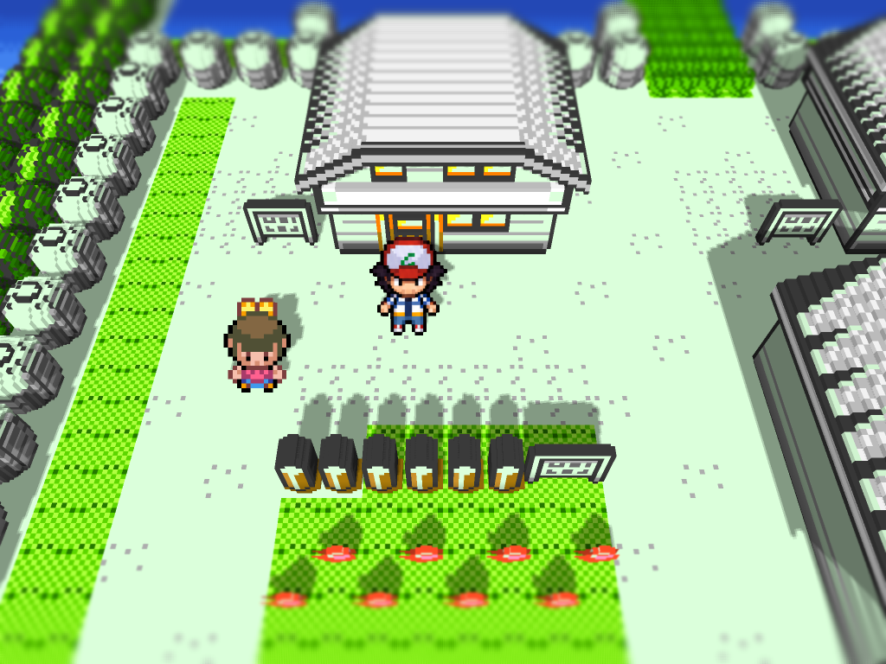
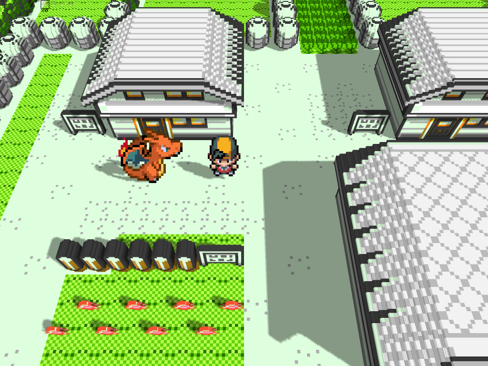

# Gen1Recomp Mods

Mods for [g1recomp](https://github.com/bryanthaboi/gen1recomp).

## HGSS Visual Overhaul

A visual pack for Pokemon Yellow. It replaces the intro portraits, adds HGSS
overworld charsets, and preserves the full-color party icons.

[Mod documentation, current screenshots and installation guide](hgss_sprites/README.md)

[Download HGSS_SPRITES 0.3.1](https://github.com/LucianoNeo/gen1recomp-mods/releases/tag/v0.3.1) · [All releases](https://github.com/LucianoNeo/gen1recomp-mods/releases)

### Outdoor Voxel 3D

Fresh in-game outdoor capture with the Voxel pipeline enabled:

The selectable HGSS player sprites also work in the Voxel map renderer:

Ash and Ethan also have dedicated bicycle sheets, selected automatically when
the player mounts the bike.

Battle artwork is self-contained. `BATTLE ART SCOPE` selects `TRAINERS ONLY`
or `COMPLETE`, while the front/back/trainer generation selectors choose the
bundled Gen 1–5 collections. `PLAYER SELECT` also chooses the battle trainer
intro: RED, ASH or ETHAN. Missing files fall back to g1recomp's original
sprites.

### Gym captures

### HGSS party icons

The party screen keeps the custom full-color HGSS icon set:

### Character updates in 0.3.1

Voxel grounding was corrected for the HGSS overworld replacements. The mod
menu now offers `PLAYER SELECT` (`RED`, `ASH`, `ETHAN`), `PARTY MENU`
(`ON`/`OFF`) and `SPRITE SIZE` (`0.5x`–`1.0x` in `0.1x` steps). Sprite size
changes all overworld characters while preserving source quality and does not
alter battle art or party icons. Ash and Ethan keep a 28px logical footprint
so their map scale matches Red.

## Quick installation

1. `CRYSTAL_251` is an optional compatibility companion; no battle-art mod is required.
2. Download the HGSS_SPRITES ZIP from the release above.
3. Import it through the g1recomp mod manager and restart the game.

Package: `0.3.1` · Lean runtime package · Compatible with g1recomp
`>=0.1.75 <0.2.0` (tested on `0.1.78`).
