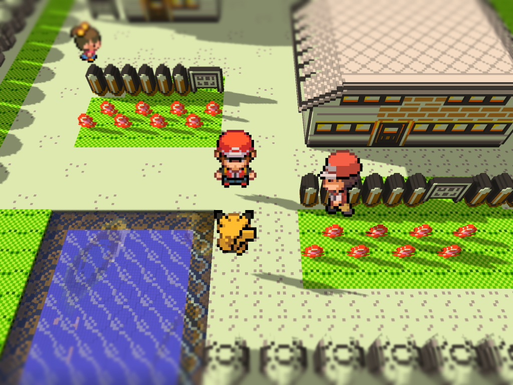
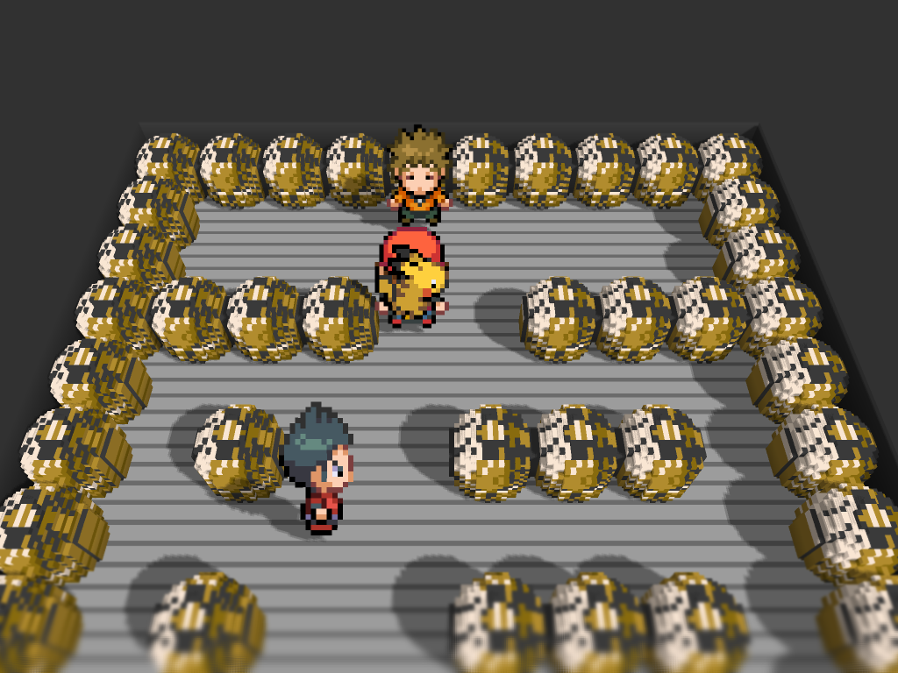
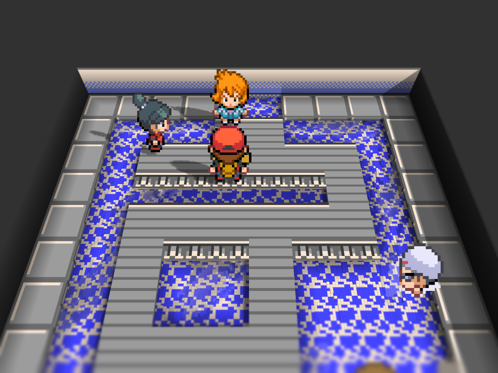
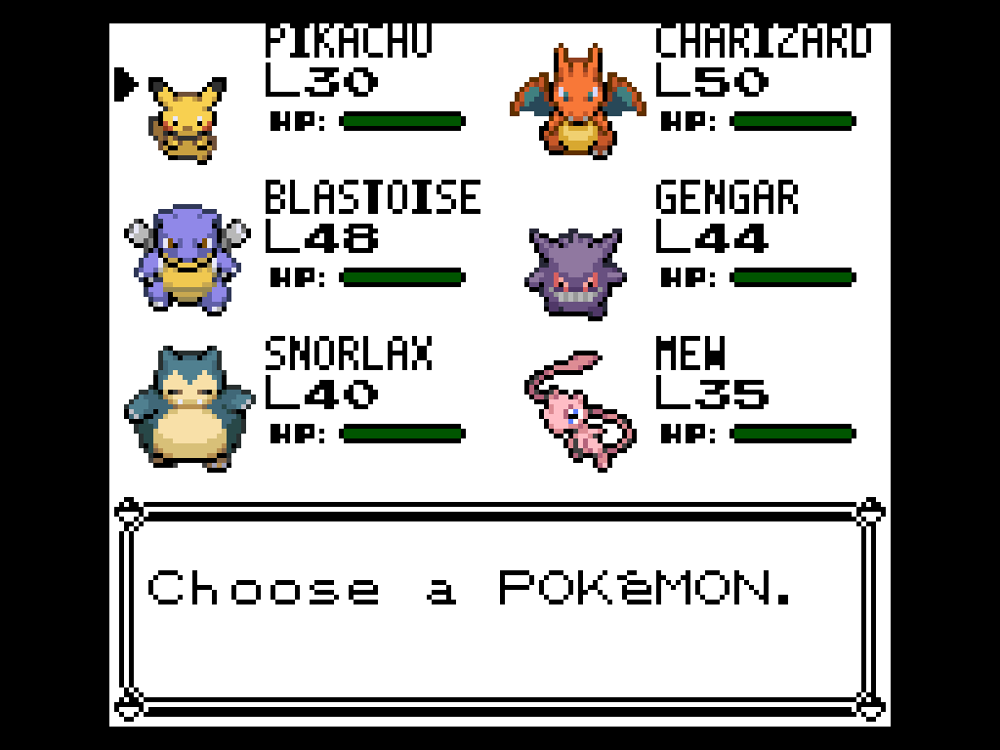

# HGSS Visual Overhaul

A visual pack for Pokemon Yellow on g1recomp, inspired by HeartGold and
SoulSilver. Battle Art Voxel Fork is recommended for its Voxel renderer.

## Scope

This pack owns only two visual areas:

- the opening portraits (Nidorino, Professor Oak, Red and Blue);
- HGSS overworld charsets, including walking directions and frames;

## Current in-game captures

### Outdoor Voxel 3D

Outdoor Voxel capture:

### Gym captures

### Party icons

The party menu retains the full-color HGSS icon set:

## Installation

1. Optionally install [Battle Art Voxel Fork](https://github.com/absol89/DramaticShapeVoxelMod) for the Voxel renderer.
2. Download the `HGSS_SPRITES` 0.2.3 asset from the [releases page](https://github.com/LucianoNeo/gen1recomp-mods/releases).
3. Import the ZIP in the g1recomp mod manager and enable **HGSS Visual Overhaul**.
4. Restart g1recomp after installing or updating either mod.

Compatibility: g1recomp `>=0.1.75 <0.2.0`, Pokemon Yellow and Mod API 2.

## Runtime formats

| Asset | Runtime format |
|---|---|
| Walking overworld sheet | `32x192`, six frames |
| Jessie / James walking sheet | `128x768`, six frames |
| Intro portrait sheets | native transparent PNG |
