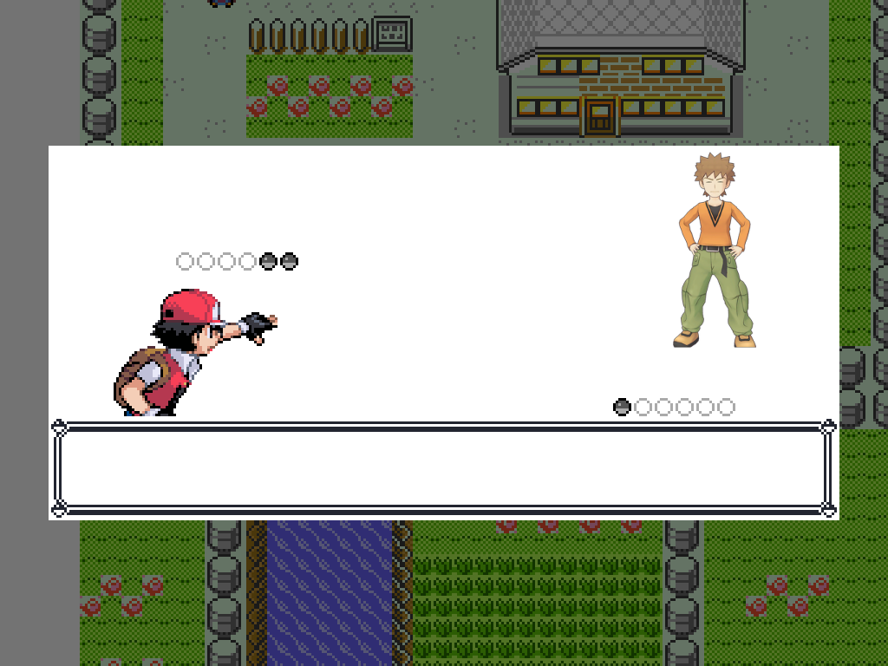
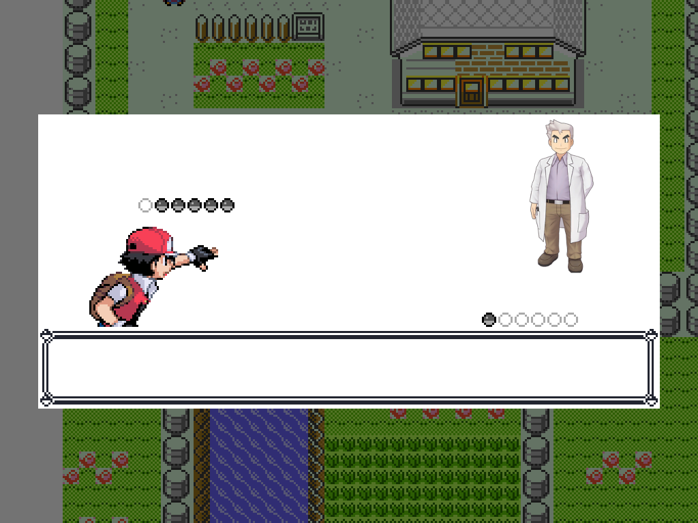
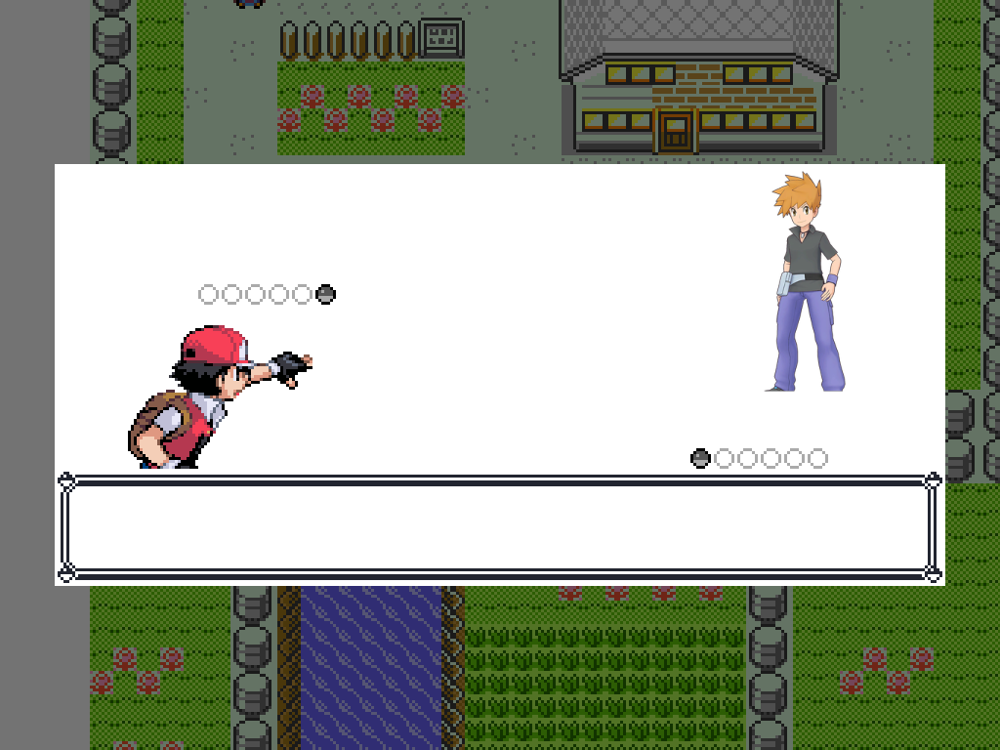
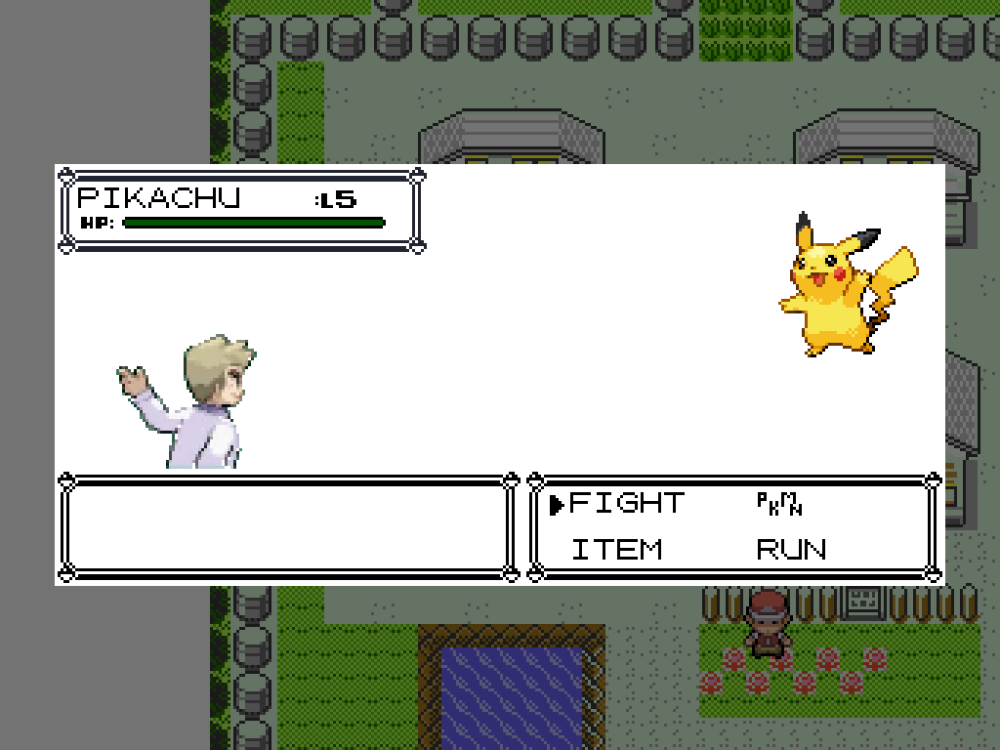
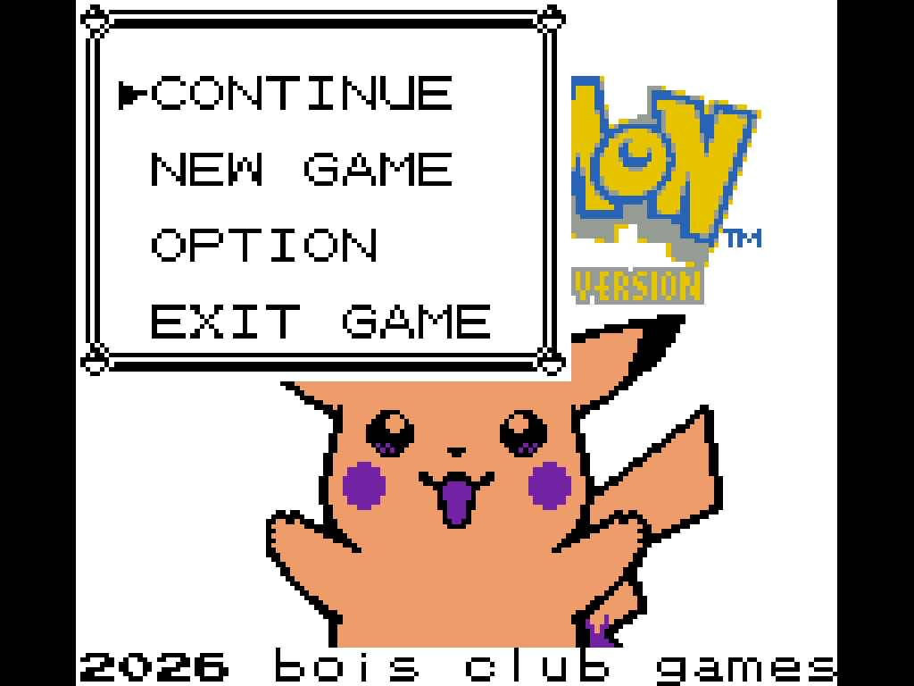
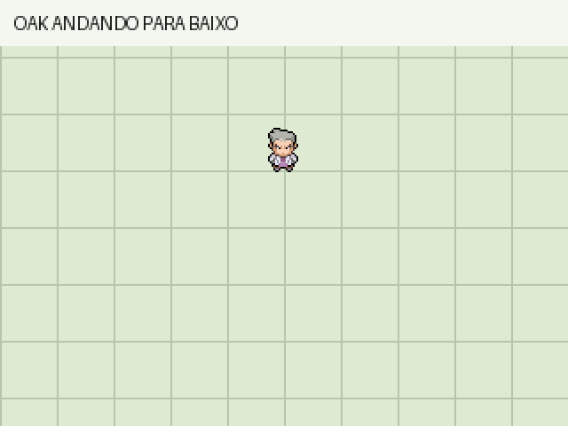
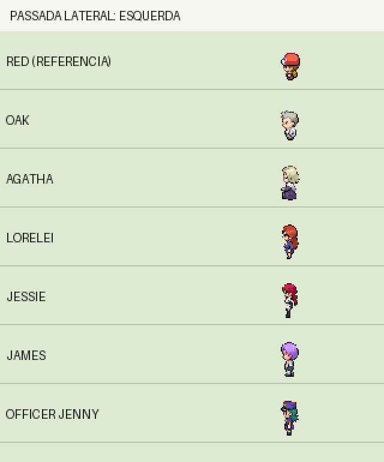
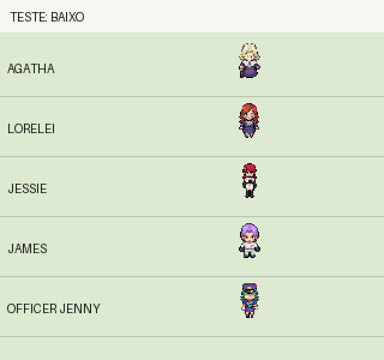

# HGSS Visual Overhaul


Mod visual para **Pokémon Yellow no g1recomp**, inspirado em Pokémon
HeartGold e SoulSilver. Ele substitui sprites de batalha, personagens no
mapa, ícones do time e elementos da interface, preservando cores RGB e a
densidade dos assets de Nintendo DS sempre que o motor permite.

## Capturas

### Batalhas em layout WIDE

Retratos em alta resolução são apresentados depois do canvas de 160×144 para
evitar a perda de detalhes. Os layouts clássico e WIDE possuem posicionamento
independente.

| Brock | Professor Oak |
|:--:|:--:|
|  |  |

| Gary/Blue | Captura demonstrativa do Oak |
|:--:|:--:|
|  |  |

### Time e interface

Os ícones do time usam folhas coloridas de dois frames. Bordas, cursores e
barras de HP seguem a linguagem visual de HGSS sem reduzir a interface à
paleta do Game Boy.


### Tela inicial

O Pikachu do título permanece original e respeita a ordem das camadas: menus
e caixas de diálogo sempre aparecem à frente dele.



## Demonstrações animadas

### Movimento do Professor Oak

Direções, alternância dos pés e baseline foram revisados para eliminar pulos,
pisca-pisca e deslizamento.



[Abrir vídeo MP4](docs/media/oak-movement.mp4)

### Padrão de caminhada lateral

Os personagens novos usam a mesma cadência lateral validada no Red.



[Abrir vídeo MP4](docs/media/red-side-walk.mp4)

### NPCs novos

Teste conjunto das folhas criadas ou adaptadas para personagens que não
possuíam um charset HGSS completo disponível.



[Abrir vídeo MP4](docs/media/new-npcs-motion.mp4)

## Principais modificações

- 151 sprites frontais e 151 sprites traseiros de Pokémon em batalha;
- 151 ícones coloridos e animados para a tela do time;
- 46 classes de treinadores com retratos distintos;
- retratos HD de Oak, Red, Blue, Jessie, James, líderes e Elite Four;
- charsets overworld em 32×32 para Red, Blue, Oak, líderes, NPCs e Pokémon;
- Pikachu seguidor e Surfing Pikachu nos registros corretos;
- animação do Red de costas executada uma única vez ao iniciar a batalha;
- sprite dedicado do Oak de costas no tutorial de captura;
- Trainer Card com Red, moldura, selos e oito insígnias de Kanto;
- bordas e cursores globais em estilo DS;
- barras de HP verdes, amarelas e vermelhas em estilo HGSS;
- correções específicas para o layout de batalha WIDE;
- opção `CRISP DISPLAY` para evitar escala fracionária e deformações.

## Instalação

1. Baixe `HGSS_SPRITES-0.0.9.zip` na página de releases.
2. Copie o ZIP para a pasta `mods` do g1recomp ou extraia-o como
   `mods/HGSS_SPRITES/`.
3. Habilite **HGSS Visual Overhaul** no gerenciador de mods.
4. Reinicie o jogo depois de atualizar uma versão anterior.

Compatibilidade: g1recomp `>=0.1.75 <0.2.0`, Pokémon Yellow e Mod API 2.

## Formatos utilizados

| Asset | Formato runtime |
|---|---|
| Overworld com caminhada | `32×192`, seis frames |
| NPC parado | `32×96` |
| Objeto parado | `32×32` |
| Ícone do time | `32×64`, dois frames |
| Pokémon em batalha | `80×80` |
| Retrato HD de treinador | `320×320` |
| Chrome da interface | glyphs de `8×8` |

O adaptador interno é limitado às folhas deste mod e está declarado pela
permissão `engine_internals`. Ele não modifica os sprites vanilla de outros
mods.

## Verificação

O pacote é validado por contagem, dimensões e capturas determinísticas geradas
diretamente pelo motor:

```powershell
python scripts/build_mod_assets.py --check
python scripts/build_mod_assets.py --package
```

Os testes atuais verificam 151 pares de batalha, 151 ícones, todos os sprites
overworld mapeados, tela inicial, menu do time, tutorial do Oak e retratos de
treinadores nos layouts clássico e WIDE.

## Referências

- [Art Pipeline do g1recomp](https://github.com/bryanthaboi/gen1recomp/wiki/Guide-Art-Pipeline)
- [Referência de manifests](https://github.com/bryanthaboi/gen1recomp/wiki/Reference-Manifest)
- [Referência de registries](https://github.com/bryanthaboi/gen1recomp/wiki/Reference-Registries)
- [Trainers HGSS — The Spriters Resource](https://www.spriters-resource.com/ds_dsi/pokemonheartgoldsoulsilver/asset/26955/)
- [Galeria de personagens — Bulbapedia](https://bulbapedia.bulbagarden.net/wiki/User:Team_Rocket_Grunt/List_of_game_characters_by_overworld_sprite)

Pokémon e os designs de HeartGold/SoulSilver pertencem à Nintendo, Game Freak
e The Pokémon Company. Este é um projeto visual não comercial.
