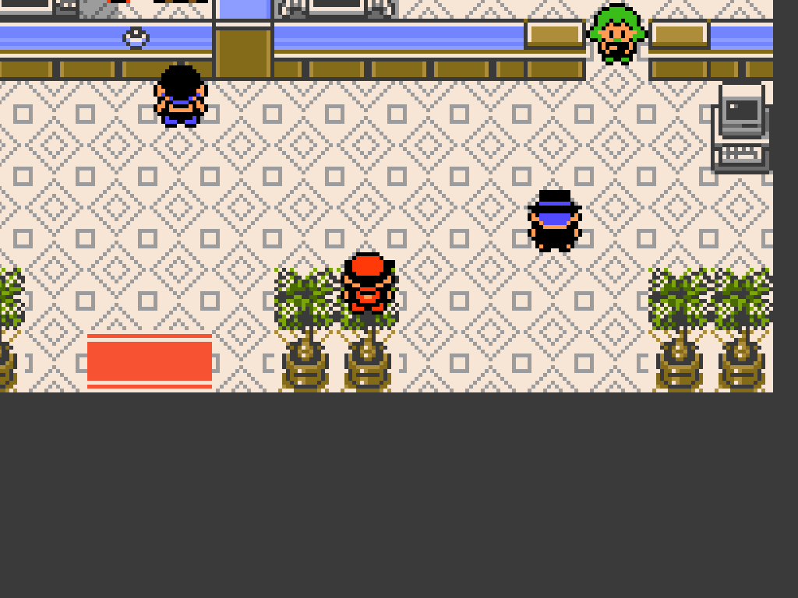
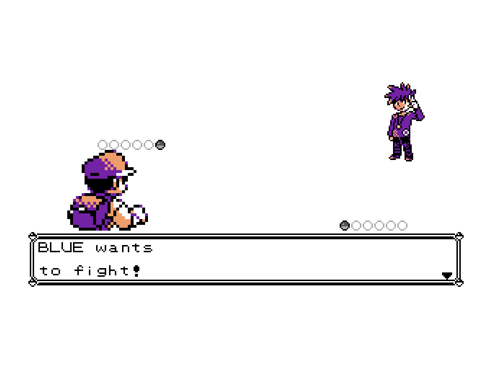
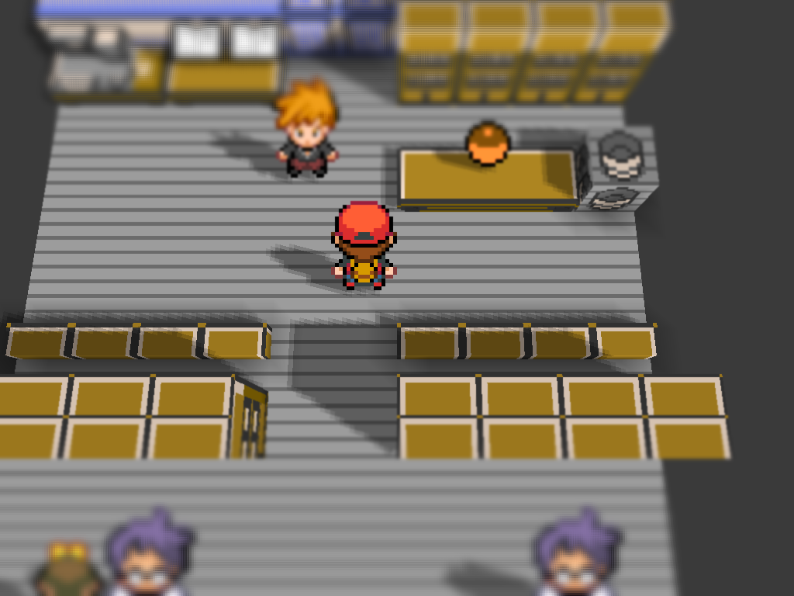
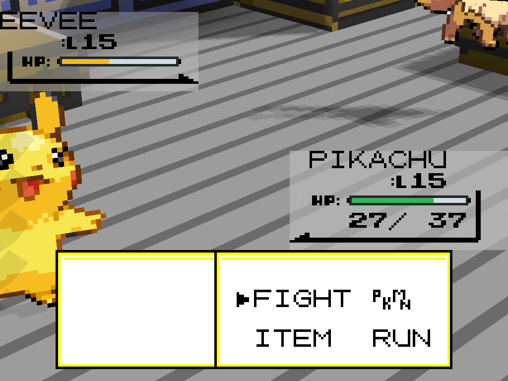

# HGSS Visual Overhaul


A visual overhaul for **Pokémon Yellow on g1recomp**, inspired by Pokémon
HeartGold and SoulSilver. It replaces battle sprites, overworld characters,
party icons, and interface elements while preserving RGB color and Nintendo DS
asset density wherever the engine supports it.

## Before and after

These four images were captured directly from fresh g1recomp runs on the same
maps and battle flow. The “Before” run had `HGSS_SPRITES` disabled; the “After”
run had version `0.1.0` enabled. They are not sprite-sheet mockups or edited
gameplay screenshots.

### Overworld characters

| Vanilla Yellow | HGSS Visual Overhaul |
|---|---|
|  |  |

The same Viridian Pokémon Center scene shows the original low-resolution
characters on the left and the color HGSS overworld charsets on the right.

### Battle trainers and player

| Vanilla Yellow | HGSS Visual Overhaul |
|---|---|
|  |  |

The same trainer-battle transition shows the original Game Boy artwork versus
the full-color HGSS trainer presentation, with the player back sprite and
dialogue frame preserved in their real game positions.

## What the mod changes

### Overworld characters and Pokémon

Red, the following Pikachu, leaders, rivals, Team Rocket, Oak, and NPC classes
use color HGSS charsets with dedicated directions and walking frames.


The same sprite pipeline also covers interior maps and keeps characters at
Red's logical size in both 2D and Voxel presentation.

### Battle Pokémon and trainers

All 151 Pokémon have color front and back battle sprites. Red, Oak, Blue,
Jessie, James, gym leaders, the Elite Four, and trainer classes use full-color
trainer portraits with real transparency.


### HGSS interface

The battle, party, and summary screens use DS-style borders and cursors, plus
green, yellow, and red HGSS HP-bar states without a forced Game Boy palette.


### Voxel compatibility

With `DRAMALESS_SHAPE` enabled, the same characters remain correctly scaled on
3D scenes. Voxel battles preserve the mod's interface and do not duplicate
trainer artwork.





## Installation

1. Download [`HGSS_SPRITES-0.1.0.zip`](https://github.com/LucianoNeo/gen1recomp-mods/releases/download/v0.1.0/HGSS_SPRITES-0.1.0.zip).
2. Import the ZIP through the g1recomp mod manager, or extract it as
   `mods/HGSS_SPRITES/`.
3. Enable **HGSS Visual Overhaul**.
4. Restart g1recomp after installing or updating the mod.

Compatibility: g1recomp `>=0.1.75 <0.2.0`, Pokémon Yellow, and Mod API 2.

## Runtime formats

| Asset | Runtime format |
|---|---|
| Walking overworld sheet | `32×192`, six frames |
| HD Jessie / James walking sheet | `128×768`, six frames |
| Standing NPC | `32×96` |
| Standing object | `32×32` |
| Party icon | `32×64`, two frames |
| Battle Pokémon | `80×80` |
| HD trainer portrait | `320×320` |
| Interface chrome | `8×8` glyphs |

The internal adapter is limited to this mod's sheets and is declared through
the `engine_internals` permission. Vanilla sprites from other mods are not
modified.

## Verification

The runtime package is checked by dimensions, asset counts, ZIP import, and
deterministic screenshots captured directly by g1recomp:

```powershell
python scripts/build_mod_assets.py --check
python scripts/build_mod_assets.py --package
```

The current QA flow covers battle pairs, party icons, mapped overworld
sprites, the title screen, the party menu, Oak's tutorial, trainer portraits,
and classic/WIDE presentation paths.

## References

- [g1recomp art pipeline](https://github.com/bryanthaboi/gen1recomp/wiki/Guide-Art-Pipeline)
- [Manifest reference](https://github.com/bryanthaboi/gen1recomp/wiki/Reference-Manifest)
- [Registry reference](https://github.com/bryanthaboi/gen1recomp/wiki/Reference-Registries)
- [HGSS trainers — The Spriters Resource](https://www.spriters-resource.com/ds_dsi/pokemonheartgoldsoulsilver/asset/26955/)
- [Character overworld gallery — Bulbapedia](https://bulbapedia.bulbagarden.net/wiki/User:Team_Rocket_Grunt/List_of_game_characters_by_overworld_sprite)

Pokémon and the HeartGold/SoulSilver designs belong to Nintendo, Game Freak,
and The Pokémon Company. This is a non-commercial visual project.
